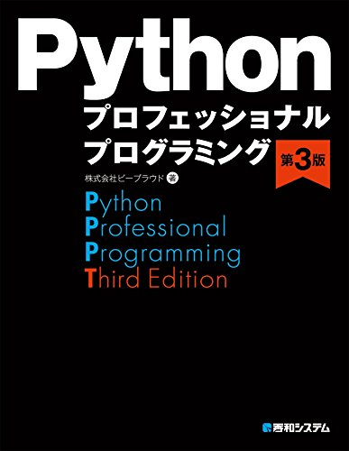

### PythonでGRPCやってみた  

---
@snap[north]
@pco2699
@snapend
@snap[west]

@snapend

@snap[east]
@size[20px](WealthNaviという会社でJavaエンジニア)
<br>
@size[20px](ジーズアカデミー DEVコース 7期卒業)
<br>
@size[20px](Python歴 : 2年ほど)

@snapend

---

### 今回のお題目

Python プロフェッショナルプログラミング 第3版

---

### めちゃくちゃ良書

---

### Pythonプロフェッショナルプログラミングのいいところ
- Pythonを公式言語として採用している株式会社ビープラウドさんが出版
- Pythonで実際に実用に耐えうるDjangoアプリの設計方法やチーム開発の手法が載っている
- その他、要件定義->設計->開発までの一連の流れが書かれていて  他社さんの開発プロセスを知りたいエンジニアの方とかに非常におすすめ

---

### ただ、、、

---

### LTのネタとしては若干内容が発表しづらい

---

### 急遽、内容変更
### (本に興味ある方はぜひ、購入して読んでみてください!)

---

### What is gRPC?
- Googleが開発したAPI通信プロトコル
- REST API/JSONに代わるAPIの通信方法として最近注目されている
- JSONだと型が無いが、gRPCだと型をつけられて安心

---

### 今回つくるもの


---

### 実際にPythonでgRPCを実装してみよう
1. .protoファイルを作成
1. grpc-toolsでPythonコードを生成
1. 生成されたコードからサーバー・クライアントのコードを生成
1. 動作確認

---

### .protoファイルの作成
- .protoファイル=APIの仕様を決めるインターフェースのようなファイル
```
syntax = "proto3";

package helloworld;
// 実際にサーバで実装する処理のインプット・アウトプットを記載
service Greeter {
  rpc SayHello (HelloRequest) returns (HelloReply) {}
}
// サーバ<->クライアントでやりとりするメッセージの仕様を記載
message HelloRequest {
  string name = 1;
}
// 上に同じ
message HelloReply {
  string message = 1;
}

```
---

### grpc-toolsでPythonコードを生成(1/2)
.protoファイルから実際にPythonコードを生成するためのGoogleお手製ツールをインストール
```
$ pip install grpcio-tools
$ pip install googleapis-common-protos
```

---

### grpc-toolsでPythonコードを生成(2/2)
インストールした.protoファイルからPythonコードを生成
```
$ python -m grpc_tools.protoc -Iproto --python_out=. --grpc_python_out=. protos/helloworld.proto
```

---

### 実際にインターフェースとしてPythonコードが生成されます
helloworld_pb2_grpc.py
```
class GreeterServicer(object):
  # missing associated documentation comment in .proto file
  pass

  def SayHello(self, request, context):
    # missing associated documentation comment in .proto file
    pass
    context.set_code(grpc.StatusCode.UNIMPLEMENTED)
    context.set_details('Method not implemented!')
    raise NotImplementedError('Method not implemented!')

```

---


---

### 現場からは以上です
